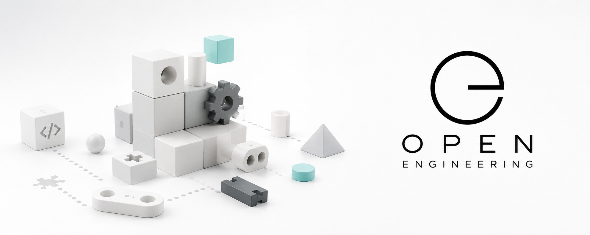

# Open Engineering Elements

Building the language of reusable engineering.

Open Engineering Elements is part of the Open Engineering ecosystem.

Its mission is to define the common foundation upon which reusable engineering assets can be created, validated, shared, and composed.

Rather than maintaining domain-specific content, Open Engineering Elements defines the schema that every engineering element definition must follow. It provides the meta-model that enables independent organizations to build interoperable libraries of reusable engineering elements.

⸻

## Why Elements?

Every engineering discipline has reusable building blocks.

Software engineers reuse components.

Architects reuse patterns.

Designers reuse assets.

Storytellers reuse narrative structures.

Educators reuse learning materials.

Despite their differences, these building blocks share common characteristics:

* they have an identity
* they have properties
* they evolve over time
* they relate to other elements
* they can be composed into larger systems

Open Engineering Elements provides a common language for describing these building blocks without prescribing what they represent.

⸻

## Mission

Our mission is to establish a universal foundation for reusable engineering by defining:

* the Element Definition Schema
* common conventions
* validation rules
* lifecycle semantics
* relationships between elements
* interoperability across repositories and organizations

The project intentionally remains domain-agnostic.

It does not define what a character, story, map, brand, or infrastructure element looks like. Instead, it defines how such definitions are expressed.

⸻

## How It Works

Open Engineering distinguishes three layers.

1. Element Definition Schema

The Element Definition Schema specifies the structure that every element definition must follow.

It answers the question:

“What does an element definition look like?”

This schema is maintained by Open Engineering Elements.

2. Element Definitions

Individual organizations define their own kinds of elements by creating Element Definitions that conform to the Element Definition Schema.

Examples include repositories that define their own engineering concepts, visual assets, educational building blocks, infrastructure artifacts, or any other reusable domain-specific elements.

Each organization owns its own definitions while sharing a common foundation.

3. Elements

Concrete elements are then created from those definitions.

These elements become the reusable building blocks that applications, documentation, websites, presentations, AI systems, games, videos, and other experiences can compose into larger solutions.

⸻

## Separation of Concerns

Open Engineering Elements deliberately avoids knowledge of any specific engineering domain.

Instead, responsibility is divided as follows:

* Open Engineering Elements defines how Element Definitions are described.
* Domain-specific organizations define their own Element Definitions.
* Applications and ecosystems create and compose Elements from those definitions.

This separation allows new domains to emerge without requiring changes to the foundation.

⸻

## Vision

Open Engineering aims to make engineering assets as composable as software components.

By sharing a common language for defining reusable elements, independent projects can collaborate while remaining loosely coupled.

The result is an ecosystem where engineering knowledge can be defined once, reused many times, and composed into increasingly sophisticated systems.

Open Engineering Elements provides the foundation that makes this possible.
